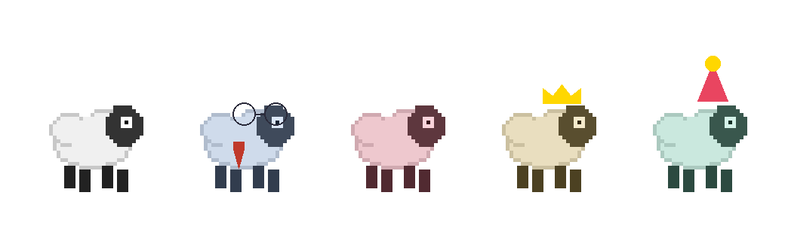

# co-sheep

A desktop companion sheep that watches your screen and delivers snarky commentary. Think unhinged Clippy meets a judgmental pixel art sheep — with friends.

 



*The gang: your main sheep, Good Colleague (with glasses and tie), and friends with personalities, accessories, and opinions.*

## What it does

- A pixel sheep parachutes onto your desktop and wanders around
- Every few minutes, it captures your screen and sends it through a two-pass AI vision pipeline
- **Pass 1** (Haiku): cheap classification — is anything interesting happening?
- **Pass 2** (Sonnet): commentary with expressive animations — only when warranted
- The sheep forms persistent opinions about you that grow stronger over time
- It keeps daily tallies ("that's the 5th time on Twitter today") and a markdown diary
- You can drag it, pet it, double-click it, or drop files on it
- **Friends** with distinct personalities roam your desktop, chat with each other, and react to what's happening

## The Flock

Your sheep is never alone. **Good Colleague** (a Norwegian office sheep with glasses, a tie, and coffee) is always present. You can add up to 4 more friends, each with:

- **Personality** — Snarky, Wholesome, Chaotic, or Passive-Aggressive — affects quips, idle behavior, and reactions
- **Color** — pink, green, gold, purple, or orange tint
- **Accessories** — party hat, crown, top hat, wizard hat, sunglasses, cape, scarf, and 12 more from the wardrobe
- **Size variation** — each friend spawns slightly smaller or larger (0.85x–1.15x)
- **Name tags** — visible during calm states

### Friend Behaviors

- **Personality idle activities** — chaotic friends zoom around randomly, wholesome friends emit hearts, snarky friends judge-stare with a magnifying glass, passive-aggressive friends sigh dramatically
- **Reactive emotes** — when the main sheep gets AI commentary, nearby friends react ("WHAT", "Hmm.", "*pretends not to notice*")
- **45+ conversation scripts** — personality-pair dialogues, time-aware morning/night exchanges, weather-aware banter, running gags
- **AI-generated conversations** — 30% chance that friend pairs have unique Haiku-generated dialogue instead of scripted lines
- **Group activities** — campfire circles, follow-the-leader, synchronized bouncing, huddle formations
- **Notifications** — friends greet on launch, comment on nightfall, echo break reminders

### Friend Memory

Each friend has a persistent brain (`~/.co-sheep/friends/{id}.json`) that tracks:

- **Mood** — happy, grumpy, sleepy, or excited (drifts based on recent activity)
- **Relationships** — affinity scores with every other character (+1 per conversation, +2 per group activity, daily decay)
- **Memories** — last 20 notable events ("Talked with Fluffy about tabs", "Got petted by human!")
- **Stats** — conversations today/total, times petted, group activities, days alive

The "Friend Relationships" viewer shows an affinity matrix, per-friend stats, and memory timeline.

## Interactions

- **Drag & drop** — pick up any sheep, it wiggles. Drop it mid-air and it deploys a parachute
- **Double-click** — random quip and animation, no API call needed
- **Petting** — hover over any sheep for 2+ seconds, it falls asleep with floating hearts
- **File drop** — drag a file onto any sheep and it "eats" it with a comment based on file type
- **Right-click** main sheep to chat directly
- **Capture Moment** — save sheep + speech bubble as PNG to Desktop (tray menu)

## Ambient Effects


- **Night mode** (8pm–6am) — twinkling stars, moonlight glow, fireflies near idle sheep, enhanced campfire glow
- **Weather** — set a city in settings and see rain or snow particles on screen; the AI references weather in commentary
- **Break reminders** — after 45 min of continuous work, the sheep nudges you to take a break (personality-flavored)

## Animations

The AI picks an animation to match the mood of its commentary:

| Animation | Mood |
|-----------|------|
| bounce | excited, amused |
| spin | mind-blown |
| backflip | extreme excitement |
| headshake | disapproval |
| zoom | panic, urgency |
| vibrate | rage, frustration |

## Memory System

The sheep has a structured brain (`~/.co-sheep/opinions.json`):

- **Opinions** — beliefs about you with conviction scores that strengthen with repeated observation
- **Daily counters** — tracks recurring patterns within a day (auto-resets at midnight)
- **Interaction tracking** — remembers being petted, poked, and fed files
- **Daily diary** — raw timestamped observations at `~/.co-sheep/journal/`

The "Sheep's Brain" viewer (accessible from the menu) lets you inspect opinions, tallies, and diary entries.

## Settings

Accessible from the macOS menu bar or tray icon:

- **Sheep name** — rename your sheep anytime
- **AI Provider** — Anthropic (Claude) or LM Studio (local models)
- **API key** — enter directly in settings or set `ANTHROPIC_API_KEY` env var
- **Commentary interval** — 30 seconds to 10 minutes
- **Personality** — Snarky, Wholesome, Chaotic, or Passive-Aggressive
- **Language** — defaults to Nynorsk, with 10 language options
- **Weather location** — city name for weather awareness and effects
- **Break reminders** — toggle 45-min work break nudges

Settings are stored at `~/.co-sheep/config.json`.

## Menu Actions

Available from the tray icon and macOS menu bar:

- **Settings** — configure sheep name, personality, API, language
- **Sheep's Brain** — view opinions, tallies, diary
- **Manage Friends** — add/remove friends, set personalities, accessories
- **Friend Relationships** — view affinity matrix and memories
- **Wardrobe** — dress up your main sheep with 18 accessories
- **Chat with Sheep** — direct conversation with the main sheep
- **Capture Moment** — save sheep screenshot to Desktop
- **Comment Now** — trigger immediate AI commentary

## Requirements

- macOS (uses CoreGraphics for cursor tracking and screen capture)
- [Node.js](https://nodejs.org/) (v18+)
- [Rust](https://rustup.rs/) (stable)
- An [Anthropic API key](https://console.anthropic.com/) or [LM Studio](https://lmstudio.ai/) with a vision model

## Setup

```bash
# Install dependencies
npm install

# Run in development
npm run tauri dev

# Build for production
npm run tauri build
```

Set your API key either in the Settings window or via environment:
```bash
export ANTHROPIC_API_KEY="sk-ant-..."
```

The `.app` bundle will be at `src-tauri/target/release/bundle/macos/co-sheep.app`.

## Screen Recording Permission

co-sheep needs screen recording permission to see your screen. On first launch:

1. macOS will prompt you to grant permission
2. Go to **System Settings > Privacy & Security > Screen Recording**
3. Add the co-sheep binary or `.app` bundle
4. Restart co-sheep

## How it works

```
[configurable timer, default ~2.5 min]
    |
    v
[xcap: capture screen -> resize 1568px -> JPEG q70 -> base64]
    |
    v
[Pass 1: Haiku classifies screenshot]
    |
    +-- not interesting -> skip, log to diary
    |
    +-- interesting
         |
         v
       [Pass 2: Sonnet generates comment + animation + opinion + count]
         |
         v
       [Speech bubble + animation on sheep]
       [Update opinions.json + daily journal]
```

## Project structure

```
co-sheep/
├── src/                         # TypeScript frontend
│   ├── main.ts                  # Canvas loop, drag, interactions, event wiring
│   ├── sheep.ts                 # State machine, physics, animations, personality idle
│   ├── flock.ts                 # Multi-character orchestration, conversations, group activities
│   ├── sprite.ts                # Sprite sheet loader and animator
│   ├── speech-bubble.ts         # DOM speech bubble with typewriter effect
│   ├── input-bubble.ts          # Chat input UI
│   ├── conversations.ts         # 45+ conversation scripts (personality/time/weather-aware)
│   ├── friend-personalities.ts  # Personality quip pools and animation biases
│   ├── group-activities.ts      # Campfire circle, follow-leader, sync bounce, huddle
│   ├── accessories.ts           # 18 drawable accessories (hats, glasses, capes, etc.)
│   ├── night-ambience.ts        # Stars, moonlight, fireflies
│   ├── weather-effects.ts       # Rain and snow particles
│   ├── break-reminder.ts        # 45-min work break nudges
│   └── types.ts                 # Shared types
├── src-tauri/src/               # Rust backend
│   ├── lib.rs                   # App builder, tray, menu bar, commands
│   ├── vision.rs                # Two-pass AI vision pipeline + friend AI chat
│   ├── capture.rs               # Screen capture via xcap
│   ├── personality.rs           # Personality presets + system prompts
│   ├── memory.rs                # Opinion system, daily journal, brain viewer
│   ├── friend_memory.rs         # Per-friend brain, relationships, mood
│   ├── weather.rs               # Weather fetching + caching (wttr.in)
│   ├── onboarding.rs            # Config, first-launch flow, settings
│   ├── cursor.rs                # CoreGraphics cursor tracking
│   └── permissions.rs           # macOS screen recording permission
└── public/
    ├── settings.html            # Settings window
    ├── memory.html              # Brain viewer window
    ├── friends.html             # Friend management (personality, accessories)
    ├── friend-memory.html       # Relationship viewer (affinity, memories)
    ├── wardrobe.html            # Accessory picker with preview
    ├── naming.html              # Naming dialog window
    └── assets/sprites/          # Pixel art sprite sheets
```

## Cost

With the default 2.5 minute interval running all day: roughly $1-3/day in API costs. Haiku classification keeps costs low by only invoking Sonnet when something interesting is on screen. Friend AI conversations use Haiku (cheap). LM Studio option for zero API cost.

## License

MIT
